# Application using Spring Boot, Angular, Kafka, Webpack, Microservices, Microfrontends

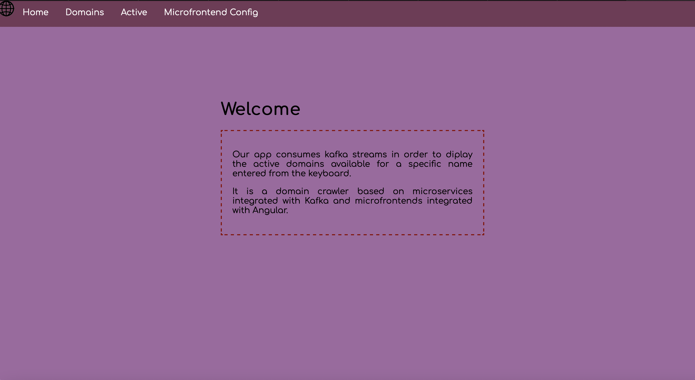
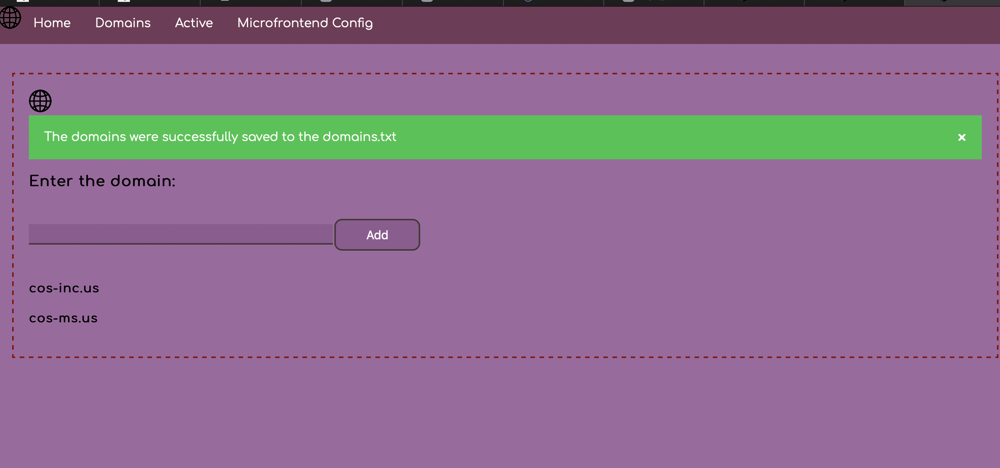
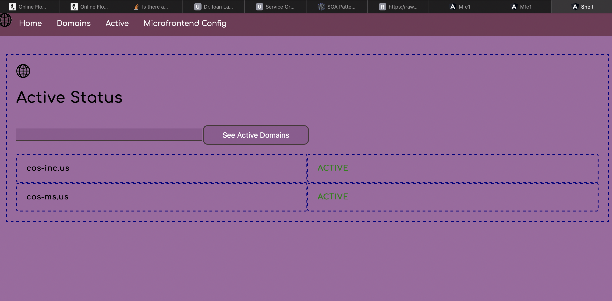

# Endpoint for Microservices:
- https://api.domainsdb.info/v1/domains/search?domain=facebook-shops&zone=us” - to pull all facebook related web domain names

# Microservices
- ‘domain-crawler’ - uses Spring Kafka
- 'domain-processor' - uses Spring Cloud Stream with Kafka Streams binder (producer)
- 'domain-service' - uses Spring Cloud Stream with Kafka Streams binder (consumer)

# Microfrontends
- ‘mfe1’ - consumes REST services exposed by the controller of the  domain crawler
- ‘mfe2’ - consumes REST services exposed by the controller of the  domain crawler
- ‘shell’ - centralizes all the microfrontends (the center microfrontend)

# The technologies used are:
- Microfrontends: Angular (Webpack, Module Federation Plugin)
- Microservices: Spring Boot, Kafka Platform


## Detail Description of the app
The Domain Crawler application was developed using Spring Boot, Kafka, Angular (with Webpack, 
Module Federation Plugin), microservices and microfrontends. The application is a platform 
that besides the web crawling of existing domains from an api made through microservices and 
microfrontends mechanism, it has a client-server architecture offering read and create functionalities 
to the client through API (Application Programming Interface) requests. There are 3 microfrontends build 
in Angular which consume REST services exposed by the microservices. The microfrontends provide the 
possibility to see the active web domains from a specific name accessing the https://api.domainsdb.info/v1/domains/search?domain=<name>-shops&zone=us" 
api and also to add the domains that were found from a specific name into a local .txt file in order to keep 
a track of them. In order to deploy the approach solution, we are using docker images for 
constructing the containers in order to build the microservices and microfrontends and 
access them on different ports. For accessing Kafka we used Zookeeper and for both of them we used docker 
images already existing. 

```
In order to access the application through docker. We made a docker container for 
each microservices, each microfrontends and also each tool or platform that we use 
aside. After making those containers, we could access the applications at different 
ports(localhost:3000 for mfe1, localhost:3001 for mfe2), but the main one is localhost:5000.
```


## run docker-compose 
```
- in root (SOA-microservices-Kafka-SpringBoot) for microservices: docker-compose up
- in root (SOA-microfrontends-module-federation-with-angular-dynamic) for microfrontends: docker-compose up
```

## Access the application within the browser
```
For microservices:
- (run ``` docker-compose up ``` before)
- open browser (any) and access: localhost:8080/domain/lookup, localhost:8080/domain/save, localhost:8080/domain/active

For microfrontends:
- (run ``` docker-compose up ``` before)
- open browser (any) and access: localhost:3000, localhost:3001, localhost:5000
```

## Configure mysql db with bind address and date time zone
```
On MacOS: sudo nano /etc/my.cnf 
add:
-bind-address:0.0.0.0
-date-time-zone: +03.00
```

## Docker images created:


## Use case UML diagram
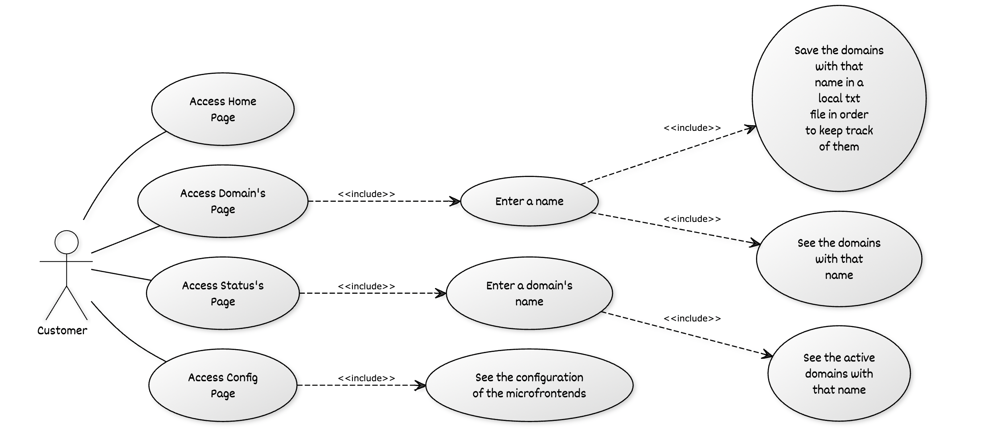

## C4Model

## System Context diagram
## 1. Whole Flow
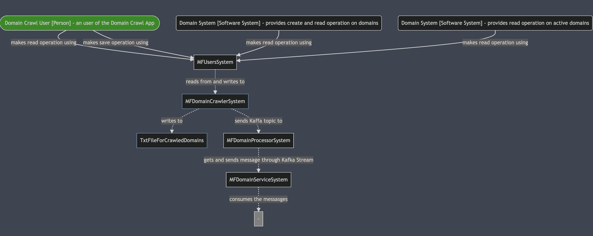

## Container diagram
## 1. Container Diagram for Spring Boot on Microservices with Kafka
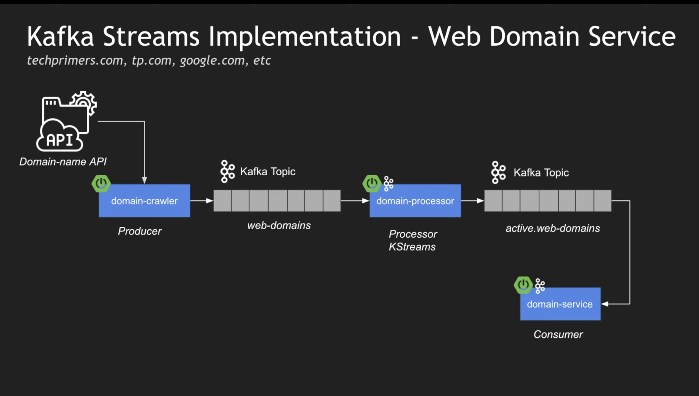

## 2. Container Diagram for Angular(Webpack) Microfrontends
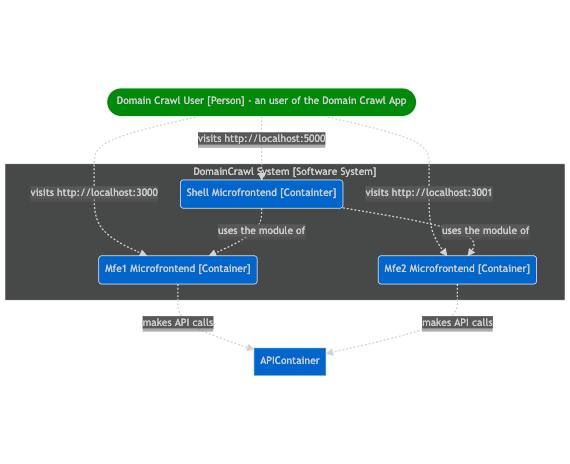

## 3. Container Diagram For All the Flow


## Component diagram

### 1. Component Diagram for Microservices:
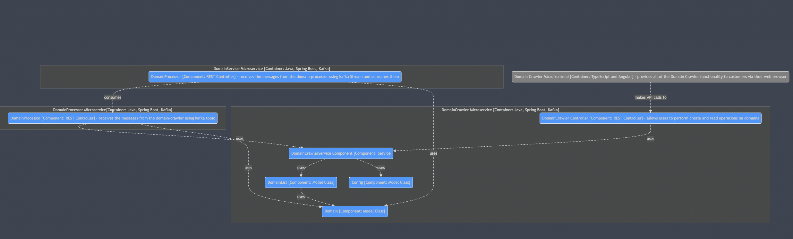

### 2. Component Diagram for Microfrontends:
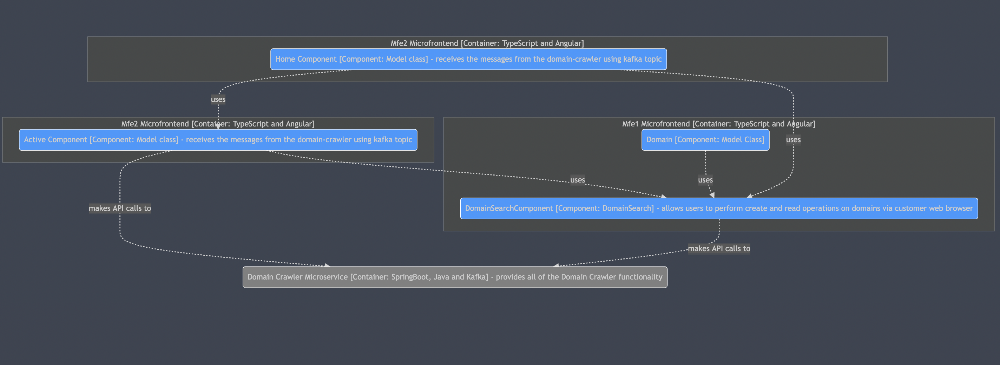

## Code
### 1. Code Diagram for Microservices:
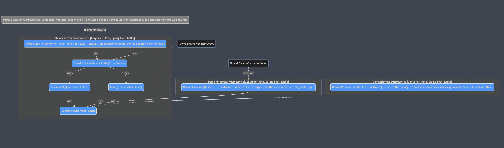

### 2. Code Diagram for Microfrontends:
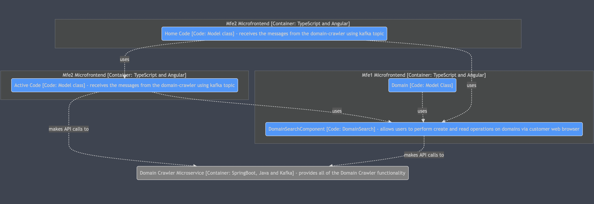

### The SOA Patterns used are:

1. Microservices Pattern - the system is decuopled in a service oriented way 
2. Publish Subscribe Pattern(Messaging Pattern) - the microservices function follows the publish subscribe pattern.
3. API Gateway Pattern - the api gateway defines how clients access the services in a Microservices architecture and is the single entry point for all clients.
4. Observability Pattern (Health Check API) - The API endpoint handler performs various checks, such as the status of the connections to the infrastructure services used by the service instance.
5. Decompose By Subdomain(Decomposition Pattern) - each domain corresponds to a different part of the business.

# To sum up, the SOA Patterns used in the solution are:

1. Systems are described as services independent of the underlying technology. - Microservices with Java and SpringBoot (used)
2. Services are implemented through messaging. - Using Kafka with topics and Kafka Streams
3. A SOA involves service providers and service consumers. - Using Kafka Streams
4. Any participating system may act as either a provider or a consumer depending on the application's workflow. - Kafka (used)
5. Services and messages are stateless. - Kafka (used)
6. Services and consumers are often implemented in different programming languages, execute in different run-time environments, or both. - Kafka (used)
7. SOA involves the services themselves, a directory of available services in some form (service discovery), and public contracts for consumers to connect and use each service (service negotiation). - Kafka (used)

## UBB Cluj-Napoca - Faculty of Mathematics and Computer Science

### Software Engineering, 2020 - 2022

- 2st year - 1st semester
- Software Oriented Architecture - Assessment